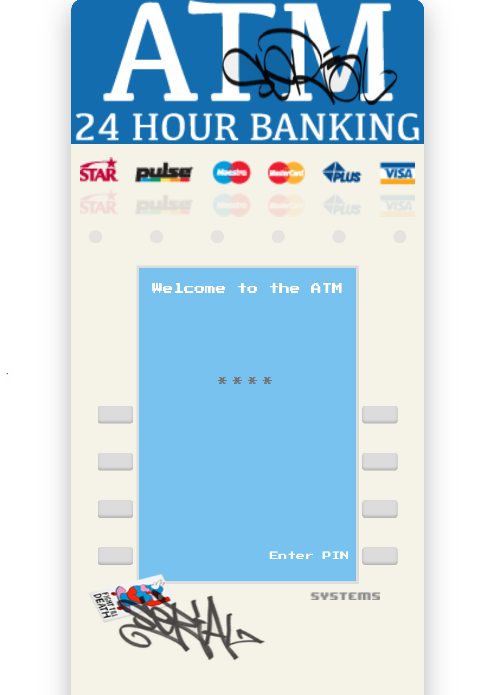
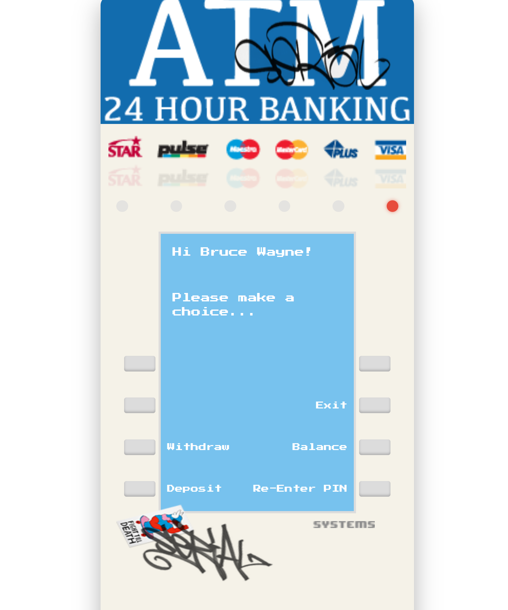
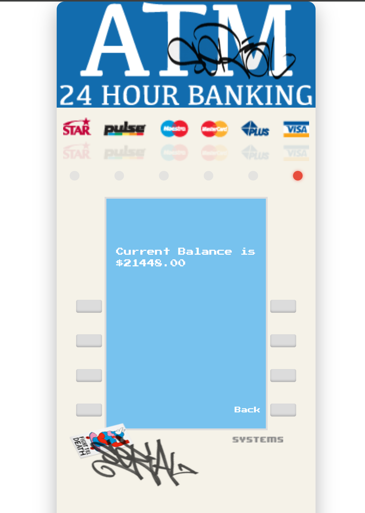

# Setup Instructions:
- Navigate to the folder on your terminal and execute `npm install` to install dependencies
- In terminal from your root project folder execute `npx json-server db.json` to start mock service.
- In another terminal from your root project folder execute `npm run dev` to start application.

## Users:
Refer to `db.json` file on root of project to look at users and their corressponding PINs. This json file reflects the database.

## Screenshots:

